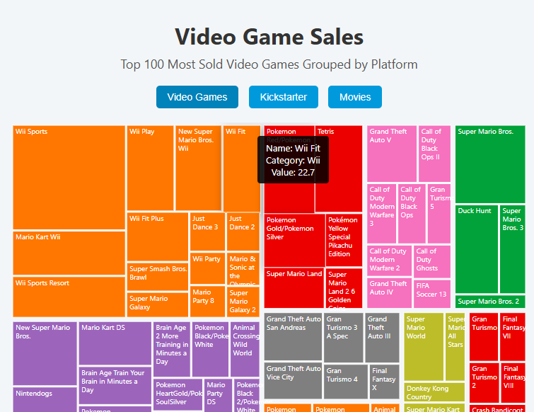

# 📊 Interactive Treemap Visualization
---

   

---
## Overview
An **interactive, responsive treemap** built with **D3.js** to visualize hierarchical datasets. Users can explore different datasets, hover over tiles for detailed info, and quickly compare categories using a color-coded legend.

---

## Features
- Switch between multiple datasets (Video Games, Kickstarter, Movies).  
- Responsive layout that adapts to all screen sizes.  
- Interactive tiles with hover tooltips showing detailed information.  
- Labels automatically wrap inside tiles for readability.  
- Modern design with smooth hover transitions, subtle shadows, and a professional color palette.  
- Color-coded legend for category comparison.

---
## Technologies Used
- **D3.js v7** – Data visualization  
- **HTML5 & CSS3** – Structure and styling  
- **JavaScript (ES6)** – Interactivity and dynamic updates  

---
## Screenshot


---
## Live Demo
You can view the interactive treemap here:  
[Live Demo](https://stabat47.github.io/Treemap/)  

---
## Usage
1. Clone or download the repository:  
```bash
git clone https://github.com/your-username/interactive-treemap.git
```
2. Open index.html in a modern web browser
3. Click on dataset buttons to switch datasets
4. Hover over tiles to view detailed information

---

## Project Structure
```bash
/project-root
│
├── index.html       # Main HTML file
├── styles.css       # CSS styling
└── script.js        # D3.js logic for treemap visualization
```
---
## License
This project is **MIT licensed**

---
## Author
**Landoh Clansy** completed as part of certification project on **Data Visualization** on [freeCodeCamp](freecodecamp.org)
